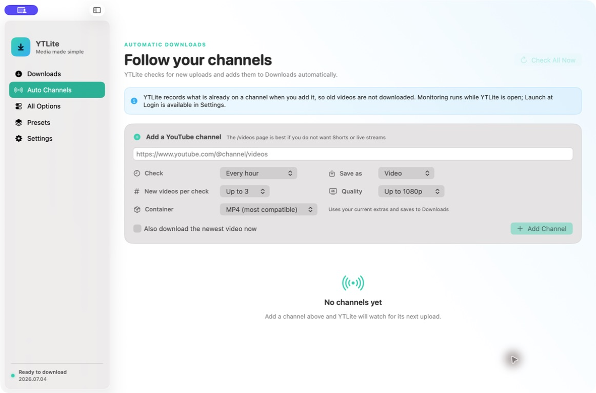

# YTLite for macOS

YTLite is a native SwiftUI interface for [yt-dlp](https://github.com/yt-dlp/yt-dlp). It makes everyday downloads approachable, supports automatic downloads from selected YouTube channels, and still exposes yt-dlp's complete command-line option catalog.



## Highlights

- Video, audio-only, and original-format downloads
- Per-channel automatic monitoring with individual schedules, formats, quality, destination, and per-check limits
- A safe first-run baseline: adding a channel does not download its back catalog
- Seen-video history plus yt-dlp's download archive for duplicate protection
- Optional Launch at Login for unattended monitoring
- Quality, container, subtitles, metadata, thumbnails, playlists, browser cookies, SponsorBlock, and archive controls
- Persistent queue with progress, speed, ETA, cancel, retry, logs, and Reveal in Finder
- Six built-in presets, custom presets, and a searchable catalog of all 323 options in yt-dlp 2026.07.04
- Checksum-verified installation of official Stable or Nightly `yt-dlp_macos` releases
- Automatic discovery of yt-dlp, FFmpeg, and Deno, Node, Bun, or QuickJS

YTLite passes an argument array directly to the selected executable; it does not run the command preview through a shell. User yt-dlp configuration files are ignored by default. Sensitive advanced values and all raw arguments are session-only and are not stored in presets, jobs, or app preferences.

## Install

1. Download the latest macOS zip from [Releases](https://github.com/Sloopdog/YTLite/releases).
2. Unzip it and move `YTLite.app` to Applications.
3. Open YTLite and use **Settings → Install yt-dlp**.
4. Install FFmpeg separately for audio conversion, merged high-quality video, thumbnails, and metadata. With Homebrew: `brew install ffmpeg`.

Release builds are universal for Apple silicon and Intel. They are currently ad-hoc signed, not Apple-notarized. If macOS blocks the first launch, Control-click the app in Finder, choose **Open**, and confirm only if you obtained it from this repository's Releases page.

Requires macOS 14 Sonoma or newer.

## Automatic channels

Open **Auto Channels**, paste a YouTube channel URL, and choose its schedule and format. A channel's `/videos` URL is recommended when you want regular uploads without its Shorts or Live tabs.

On the first check, YTLite records the newest video IDs as its starting point. Future checks add only unseen uploads to Downloads. Enabling **Also download the newest video now** is the explicit exception. Monitoring runs while YTLite is open; closing its window leaves the app running, while **Quit YTLite** stops checks. Launch at Login is available in Settings.

## Build from source

Requirements: macOS 14+, Xcode 16 or newer, and [XcodeGen](https://github.com/yonaskolb/XcodeGen).

```sh
brew install xcodegen
git clone https://github.com/Sloopdog/YTLite.git
cd YTLite
./scripts/build-release.sh
```

The app and universal zip are written to `dist/`. For development:

```sh
xcodegen generate
xcodebuild -project YTLite.xcodeproj -scheme YTLite \
  -derivedDataPath DerivedData CODE_SIGNING_ALLOWED=NO test
```

See [scripts/README.md](scripts/README.md) for the checksum-verified option-catalog workflow.

## Privacy and safety

YTLite has no analytics, accounts, advertisements, or telemetry. Preferences and channel history stay in macOS User Defaults, download archives stay in the selected output folders, and installed yt-dlp lives in the user's Application Support folder. Network requests go to the media sites a user selects and to official GitHub release assets when installing or updating yt-dlp.

YTLite does not bypass DRM. Download only media you own or have permission to save, and follow the site's terms and applicable law. See [SECURITY.md](SECURITY.md) for reporting security issues.

## Independent projects and licensing

YTLite does not bundle yt-dlp or FFmpeg. The managed yt-dlp installer downloads the official executable and verifies its published SHA-256 checksum. The official `yt-dlp_macos` executable contains GPLv3+ components; FFmpeg licensing depends on the chosen build. They are independent projects and are not covered by YTLite's MIT license. See [THIRD_PARTY_NOTICES.md](THIRD_PARTY_NOTICES.md).

YTLite is available under the [MIT License](LICENSE).
